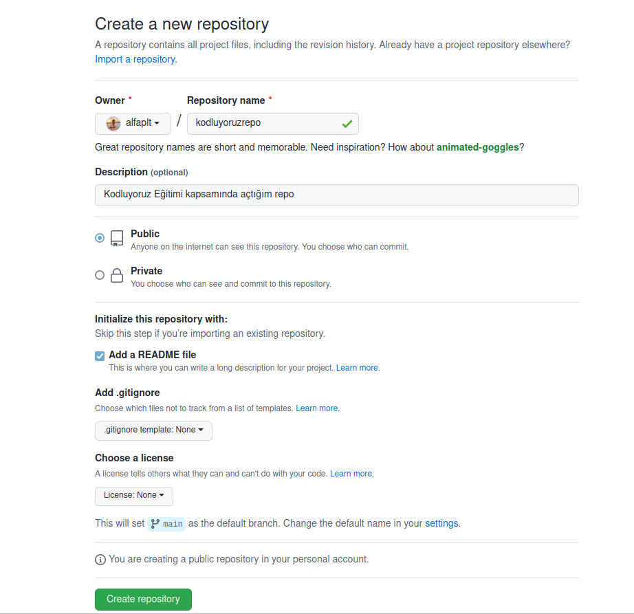

# Kodluyoruz Repom
[Kodluyoruz]() Eğitimi kapsamında açtığım ilk olmayan fakat anlamlı olan repom.



## Installation

Öncelikle projeyi clonelayın. (Buraya sizin reponuzdan aldığınız link gelecek)

```bash
git clone https://github.com/cengizcmataraci/kodluyoruzilkrepo.git 
```

## Usage

Projeyi cloneladıktan sonra Visual Studio Code programında açınız.

Linux için:

```bash
cd kodluyoruzilkrepo
code .
```

## Contributing

Pull requestler kabul edilir. Büyük değişiklikler için, lütfen önce neyi değiştirmek istediğinizi tartışmak için bir konu açınız.

## License

[MIT](https://choosealicense.com/licenses/mit/)

[patika.dev](https://app.patika.dev/alfaplt)


